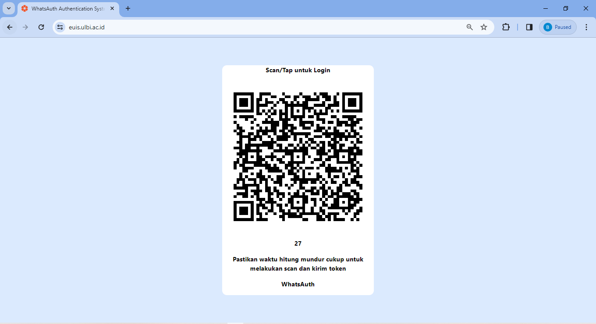
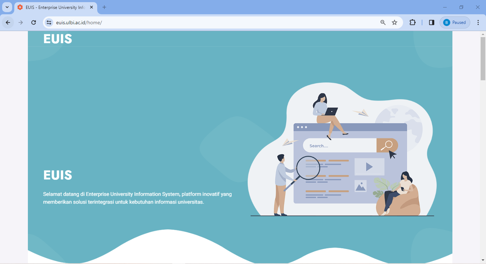
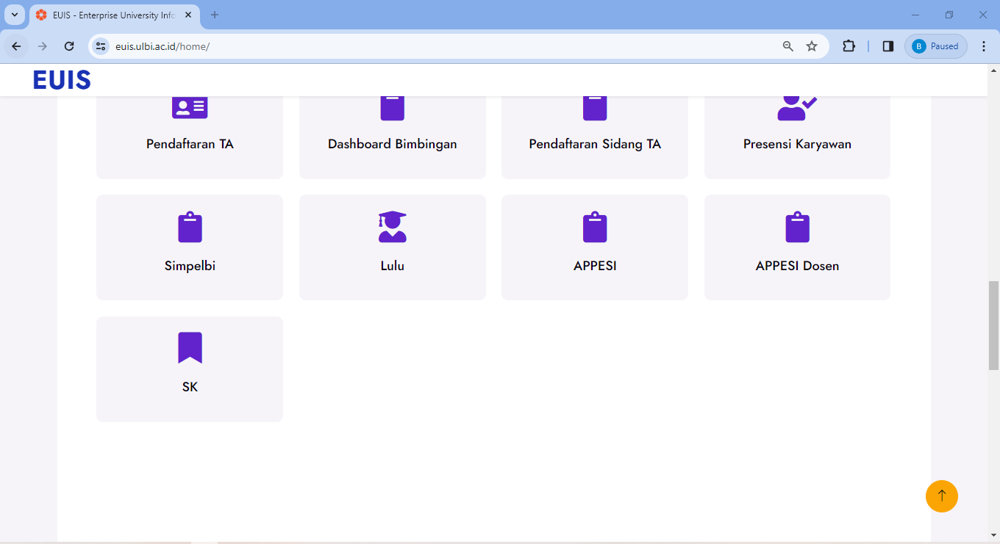
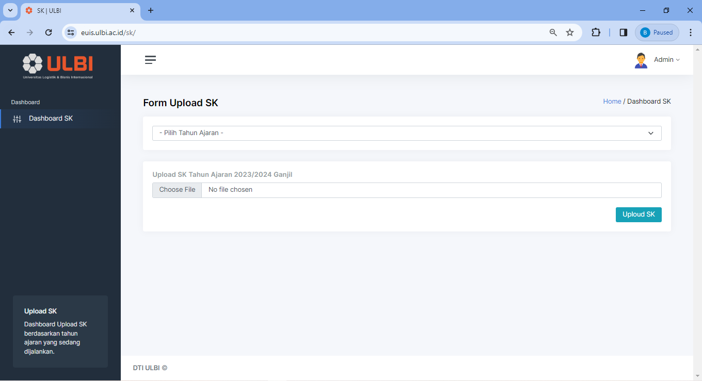
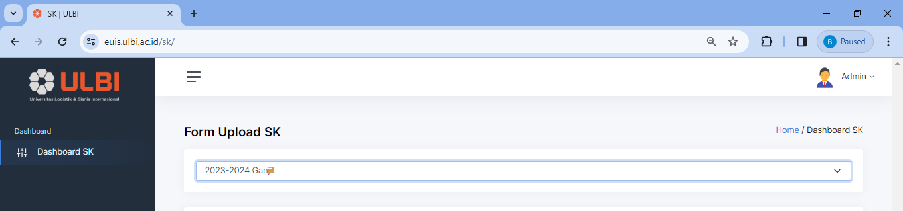
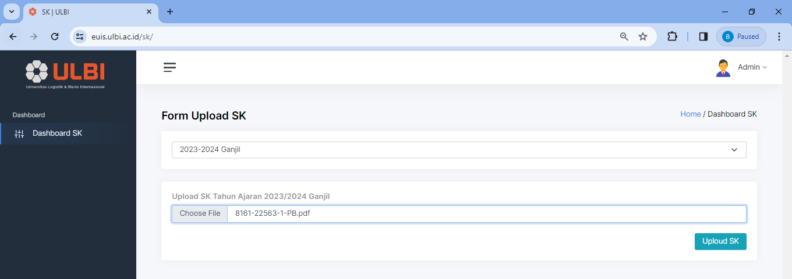

# rubrikbkd
Untuk memenuhi berbagai Rubrik BKD, [dasar hukum](./kepdirjendikti2021.pdf) dan [info tambahan](./rubrik.pdf)

Komentar harus detail jika tidak sesuai dengan klaim 

## Kewajiban Khusus

* Jurnal terakreditasi nasional artinya sinta kategori 1-6 bukan 1 dan 2 saja
* Kalimat atau menandakan pilih salah satu bukan semuanya
* karil berlaku untuk 5 semester kedepan (untuk klaim nilai SKS nya hanya bisa diklaim pada saat di laporkan, tidak berlaku klaim SKS selama 5 semester)
* kewajiban khusus berlaku setelah tmt +3 tahun bukan tmt 0-3 tahun


## Pelaksanaan Pendidikan

### Mengajar : Berita Acara Perkuliahan

  
ketikkan perintah ke iteung:
```txt
iteung minta bap final
```
Silahkan inputkan URL yang diberikan ke sister per Kode Mata Kuliah

### Membimbing Seminar, Internship / PKL, penguji pada ujian akhir, Pembinaan Kegiatan Kemahasiswaan

  
  


Perwakilan dosen prodi melakukan upload di https://euis.ulbi.ac.id/sk. Setelah itu sk bisa diakses dari laman https://repo.ulbi.ac.id/sk 
Pilih masa LKD, pilih dokumen SK, masukkan URL SK ke dalam sister untuk laporan bimbingan PKL

### Membimbing Tugas Akhir, Tesis

  

Bukti berupa SK dan Log Bimbingan / Kartu Bimbingan bisa minta ke iteung dengan perintah
```txt
iteung minta kambing
```

# Panduan Upload SK di Euis
Untuk memudahkan upload dan mengelompokkan SK, berikut di bawah ini tutorialnya :

### 1. Scan dan masuk ke https://euis.ulbi.ac.id



### 2. Pilih menu SK


### 3. Cara upload SKnya bagaimana?
Masuk ke Aplikasi Upload SK.

Untuk upload SK anda harus memilih terlebih dahulu tahun ajarannya.

Setelah itu pilih file SK yang mau di upload.

Respon yang diberikan ketika berhasil upload SK adalah muncul card success. Selamat mencoba.
